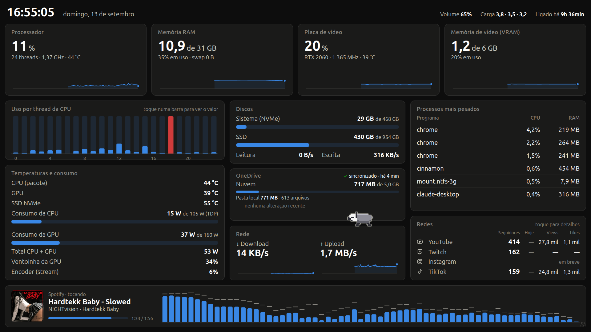
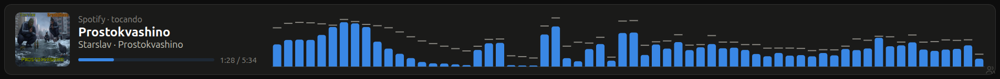

# 🦡 Painel do PC

Dashboard em tela cheia que roda num **monitor virtual** do Linux e é transmitido pro **tablet** com Sunshine + Moonlight. Mostra o hardware em tempo real, um visualizador que reage à música tocando, os números das redes sociais e tem um texugo em pixel art passeando por cima dos cards.



## O que tem

**Monitoramento**
- CPU, RAM, GPU e VRAM com gráfico dos últimos 90 s (toque no gráfico pra ver o valor de cada segundo)
- Uso por thread da CPU, temperaturas (CPU, GPU, NVMe) e consumo em watts (RAPL + `nvidia-smi`)
- Discos, leitura e escrita, rede e os processos mais pesados (a lista se ajusta ao espaço)
- Volume, carga e uptime no cabeçalho

**OneDrive** (cliente [abraunegg/onedrive](https://github.com/abraunegg/onedrive))
- Estado da sincronização em tempo real (sincronizado há X, sincronizando, erro, sem conexão, serviço parado), lido do journal do serviço
- Cota da nuvem (`onedrive --display-quota`, 1× por hora), tamanho e número de arquivos da pasta local
- Últimos uploads, downloads e exclusões

**Música**
- **Tocando agora** pelo MPRIS (Spotify, navegador, VLC…): capa, título, artista e progresso
- **Visualizador de áudio** de 64 barras que capta o som do PC (qualquer programa), com FFT feita no navegador e ganho automático



**Redes sociais**
- Card na tela principal com seguidores, "+N hoje", views e likes de cada rede
- Página de detalhes com o último vídeo/post, os totais e a tendência dos últimos 30 dias
- Aviso **AO VIVO** no cabeçalho quando tem live na Twitch

| Rede | API | Dados |
|---|---|---|
| YouTube | Data API v3 (chave de API) | inscritos, views, likes somados, vídeos, último vídeo |
| Twitch | Helix (client credentials) | seguidores, live, espectadores, jogo |
| TikTok | Login Kit Desktop + Display API | seguidores, likes do perfil, views somadas, vídeos, último vídeo |
| Instagram | Instagram API com login do Instagram | seguidores, likes e comentários somados, posts, último post |

**Texugo** 🦡
- Anda por cima dos cards e pula de um pro outro, inclusive quando a página muda
- Dança no ritmo da música, dorme quando fica parado (no print acima ele está cochilando em cima do card de música), sua quando o PC esquenta
- Comemora quando entra seguidor novo; tocar nele ganha um coração

**Páginas**: painel → redes → atalhos, trocadas por um botão discreto no canto inferior direito. A página de atalhos volta sozinha pro painel depois de 90 s sem toque.

## Como funciona

```
┌────────────── PC (Linux Mint) ──────────────┐           ┌── Tablet ──┐
│ server.py  :8787 ──► Chrome (modo app)      │           │            │
│   ├─ /api/stats   psutil, nvidia-smi, RAPL  │  monitor  │  Moonlight │
│   ├─ /api/audio   parec (monitor do som)    │  virtual  │            │
│   ├─ /api/redes   redes.py (APIs)           ├─ DP-0 ───►│            │
│   └─ /api/version recarga automática        │ Sunshine  │            │
└─────────────────────────────────────────────┘           └────────────┘
```

- `server.py` coleta as métricas numa thread (1×/s), serve a página e só escuta em `127.0.0.1`
- `index.html` é a página inteira (HTML, CSS e JS, sem dependências): gráficos em SVG, visualizador e mascote em canvas
- `onedrive.py` acompanha o journal do serviço `onedrive` e lê a cota; nunca mexe no token do cliente
- `redes.py` busca os números das redes em segundo plano, guarda o histórico diário e renova os tokens sozinho
- `abrir-painel.sh` sobe o serviço e abre o Chrome em modo app, em tela cheia no `DP-0`
- O painel se recarrega sozinho quando o `index.html` muda

O monitor virtual e a instância do Sunshine só pro tablet ficam no repo irmão [**pc-streaming**](https://github.com/meketreve/pc-streaming).

## Instalação

Precisa de Python 3 com `psutil`, `google-chrome`, `wmctrl`, `xrandr`, `curl`, `parec` (PulseAudio/PipeWire), `busctl` (systemd) e `nvidia-smi` pra GPU.

1. Serviço do usuário em `~/.config/systemd/user/pc-dashboard.service`:

   ```ini
   [Unit]
   Description=Painel do PC (servidor local 127.0.0.1:8787)

   [Service]
   ExecStart=/usr/bin/python3 /caminho/para/pc-dashboard/server.py
   KillMode=process
   Restart=on-failure
   RestartSec=3s
   ```

2. Pra abrir sozinho ao entrar na sessão, crie `~/.config/autostart/pc-dashboard.desktop` com:

   ```ini
   [Desktop Entry]
   Type=Application
   Name=Painel do PC
   Exec=sh -c "sleep 15; bash /caminho/para/pc-dashboard/abrir-painel.sh"
   X-GNOME-Autostart-enabled=true
   NoDisplay=true
   ```

3. Máquina: copie `config.exemplo.json` pra `~/.config/pc-dashboard/config.json` e ajuste (tudo é opcional):

   | Chave | Pra que serve | Sem ela |
   |---|---|---|
   | `monitor` | saída do xrandr onde o painel abre | `DP-0` |
   | `rede` | interface de rede dos gráficos | a da rota padrão |
   | `discos` | lista de `{caminho, nome}` mostrados no card de discos | só `/` |
   | `cpu_tdp_w` | TDP da CPU pra barra de consumo | mostra só os watts |

4. Atalhos: copie `atalhos.exemplo.json` pra `~/.config/pc-dashboard/atalhos.json` e ajuste. Cada item é `{id, label, icon, cmd}`, e só os ids desse arquivo podem ser executados.

Depois de mudar `server.py`, `redes.py` ou `onedrive.py`: `systemctl --user restart pc-dashboard.service`.

## Configurando as redes

As credenciais ficam em `~/.config/pc-dashboard/redes.json` (`chmod 600`, **fora do repo**). O arquivo é relido quando muda, sem precisar reiniciar:

```json
{
  "youtube":   { "handle": "@seu_canal", "api_key": "" },
  "twitch":    { "login": "seu_login", "client_id": "", "client_secret": "" },
  "instagram": { "usuario": "seu_usuario", "access_token": "" },
  "tiktok":    { "usuario": "seu_usuario", "client_key": "", "client_secret": "" }
}
```

- **YouTube**: no Google Cloud, ative a *YouTube Data API v3* e crie uma chave de API (de preferência restrita a essa API). Cada leitura gasta cerca de 5 unidades da cota diária de 10.000.
- **Twitch**: registre um app em dev.twitch.tv (tipo *Confidential*, redirect `http://localhost`) e copie o Client ID e um secret novo. Use um app próprio, pra não invalidar o secret de outros bots.
- **Instagram**: a conta precisa ser Profissional (Criador ou Empresa). No app da Meta, em *Instagram → API setup with Instagram business login*, gere o token (vale 60 dias). O servidor renova a cada 7 dias.
- **TikTok**: crie um app em developers.tiktok.com e um **Sandbox** com a sua conta como *target user*. Adicione o **Login Kit** com a plataforma **Desktop** e a Redirect URI `http://localhost:8787/tiktok/callback/`, e os escopos `user.info.basic`, `user.info.stats` e `video.list`. Depois abra `http://localhost:8787/tiktok/login` no navegador do PC e autorize. Os tokens se renovam sozinhos, e a autorização vale 1 ano.
  > **Pegadinha do portal:** se a aba **Web** do Login Kit guardar uma URI com `localhost`, o formulário recusa tudo, mesmo com a Web desmarcada. Coloque qualquer URL `https` nela.

Se a URI cadastrada no TikTok for outra, informe o endereço exato em `tiktok.redirect_uri` no `redes.json`.

## Arquivos locais (nunca versionados)

| Arquivo | O que é |
|---|---|
| `~/.config/pc-dashboard/config.json` | monitor, rede, discos e TDP da máquina |
| `~/.config/pc-dashboard/redes.json` | credenciais das redes |
| `~/.config/pc-dashboard/redes-tokens.json` | tokens renovados (Instagram, TikTok) |
| `~/.config/pc-dashboard/redes-historico.json` | histórico diário pro "+N hoje" e a tendência |
| `~/.config/pc-dashboard/atalhos.json` | atalhos da página de atalhos |
| `~/.config/pc-dashboard/onedrive-cota.json` | última cota lida do OneDrive (cache de 1 h) |
| `~/.config/pc-dashboard/chrome/` | perfil do Chrome do painel |

## Segurança

- O servidor só escuta em `127.0.0.1` e confere o cabeçalho `Host`. Os atalhos exigem o cabeçalho `X-Dash`, então outro site aberto no navegador não consegue disparar comandos.
- Os erros das APIs mostram só a mensagem, nunca a URL, que pode conter a chave.
- O hook `.githooks/pre-commit` bloqueia commit com arquivo privado, formato de chave conhecido ou o **valor real** de alguma credencial local, sem imprimir o valor. Num clone novo, ative com:

  ```bash
  git config core.hooksPath .githooks
  ```

## API local

| Rota | Conteúdo |
|---|---|
| `GET /` | a página do painel |
| `GET /api/stats` | métricas do PC, música atual e status do OneDrive (JSON, 1×/s) |
| `GET /api/audio` | PCM s16le mono 24 kHz do som do PC (stream) |
| `GET /api/redes` | números das redes, "+hoje" e histórico |
| `GET /api/shortcuts` | lista de atalhos (sem os comandos) |
| `POST /api/run/<id>` | executa um atalho (exige `X-Dash: 1`) |
| `GET /api/version` | data do `index.html`, pra recarga automática |
| `GET /tiktok/login` | inicia a autorização do TikTok |

## Licença

[MIT](LICENSE)
